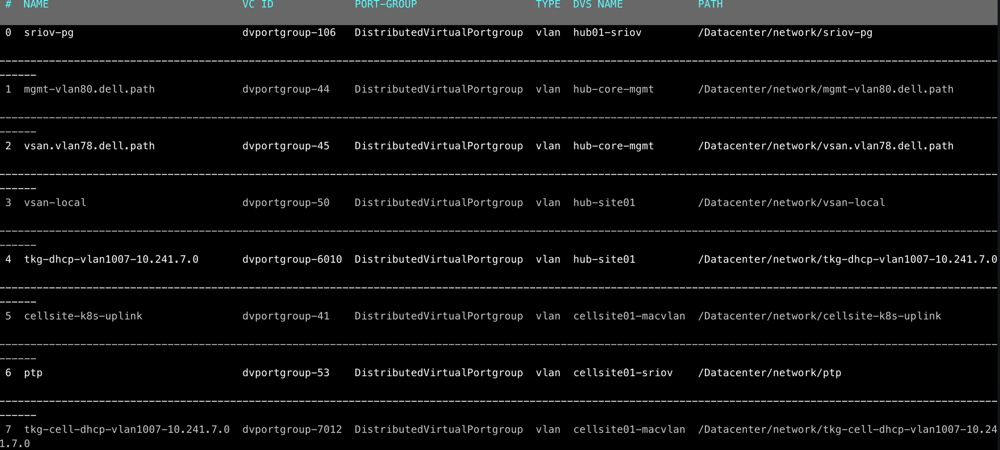

# tcactl

Tcactl  is both a tool and library for creating automation pipeline for VMware Telco Cloud Automation.
The main objective command line provides kubectl like interface to register 
cloud providers, create and manage tenant clusters, tenant applications.

## Table of content

Tool provider.
* Ability to retrieve any object from Telco Cloud Automation (in short TCA)
  via regular tcactl get semantics.
  
* Each object cloud provider, cnf, vnf etc can described via yaml, json or tabular format.

* Ability on connect, delete or update existing cloud registration.

* Ability to create cluster templates and create tenant cluster.

* Ability onboard and manage VNF and CNF.

* Ability to leverage tosca policy to scale, upgrade CNF or VNF.

* tcactl has build in Tosca parser, tool allow you apply transformation 
  to existing CSAR and upload to a system.

* tcactl resolve most of the name in all artifact. For example instead of using
  ID and execute multiply command tool allow indicate just name.
  
## Build

```
make
ls -l 
tcactl			
tcactl-darwin-amd64	
tcactl-linux-386	
tcactl-linux-amd64	
tcactl-windows-386	
tcactl-windows-amd64
```

## Usage.

Main interface provides regular main root menu command interface.

* Create
* Delete
* Describe
* Get Details

Each command has context specific sub-command.

```shell
tcactl ctl tool for VMware Telco Cloud Automation

Usage:
  tcactl [flags]
  tcactl [command]

Available Commands:
  create      Create a new object in TCA.
  delete      Command deletes object (template,cluster,cnf etc) from tcactl.
  describe    Describe TCA object details
  get         Gets object from TCA, cnfi, cnfc etc
  help        Help about any command
  init        Command initializes default config file.
  save        Saves config variables to config file.
  update      Updates cnf, cnf catalog etc
```

## Tcactl configuration.

Tools store default configuration in $HOME/.tcactl/config.yaml

For initial configuration run

```shell
tcactl init
```
The init command generate boilerplate default config.
After that we can either edit file or use tcactl to set all value.

```shell
./tcactl set -h
Command sets config variables (Username, Password etc) for tcactl.

Usage:
  tcactl set [flags]
  tcactl set [command]

Available Commands:
  api         Command sets tca end-point and saves config.
  cluster     Command sets cluster and saves config.
  nodepool    Command sets default node pool end-point and saves config.
  password    Command sets cluster username and saves config.
  username    Command sets TCA username and saves config.
```

For minimum configuration you need set api endpoint,
username and password.

```yaml
defaultcloud: default
defaultcluster: edge
defaultnodepool: default
license: apache
output: default
stderrthreshold: INFO
tca-endpoint: https://tca.vmware.com
tca-password: VMware1!
tca-username: administrator@vsphere.local
useviper: true
```
## Context sub command.

Get provides capability retrieve object from a system.

```shell
./tcactl get -h
Gets object from TCA. CNFI is CNFI in the inventory, CNFC Catalog entities.

Usage:
  tcactl get [cnfi, cnfc, clusters, pools] [flags]
  tcactl get [command]

Available Commands:
  clouds      Command retrieves a list of cloud providers.
  clusters    Return cluster information
  cnfc        Command returns CNF or VNF catalogs entity
  cnfi        Return cnf instance or all instances
  extensions  Command retrieves API extensions and respected object.
  repos       Command Returns repositories list.
  templates   Command retrieves a list of cluster templates.
  tenant      Command retrieves K8s tenant cluster, -t option provided option retrieves VIM clusters.
  vdu         Command retrieves CNF/VNF VDU information.
  vim         Command retrieves a vim-cloud provider information.
```

For example to get cluster list we can use get cluster info

```shell
./tcactl get clusters info
Using config file: /Users/spyroot/.tcactl/config.yaml
 #  ID                                    NAME      TYPE        VC NAME  ENDPOINT                   STATUS
 0  659884b9-51d8-4dfe-bbc7-96015aac1f36  k8s-mgmt  MANAGEMENT  core     https://10.241.7.32:6443   ACTIVE
---------------------------------------------------------------------------------------------------------------
 1  794a675c-777a-47f4-8edb-36a686ef4065  edge      WORKLOAD    hubsite  https://10.241.7.64:6443   NOT ACTIVE
---------------------------------------------------------------------------------------------------------------
 2  85b839fb-f7ef-436f-8832-1045c6875a01  test      MANAGEMENT  core     https://10.241.7.211:6443  ACTIVE
---------------------------------------------------------------------------------------------------------------
 3  b41cd752-f091-4c49-82c0-982f3040a03d  test02    WORKLOAD    core     https://10.241.7.80:6443   NOT ACTIVE
```

The same command can be executed with -o json or yaml flag to get respected format.

```json
{
  "Clusters": [
    {
      "id": "659884b9-51d8-4dfe-bbc7-96015aac1f36",
      "clusterName": "k8s-mgmt",
      "clusterType": "MANAGEMENT",
      "vsphereClusterName": "core",
      "managementClusterId": "",
      "hcxUUID": "20210212053126765-51947d48-91b1-447e-ba40-668eb411f545",
      "status": "ACTIVE",
      "activeTasksCount": 0,
      "clusterTemplate": {
        "name": "management",
        "version": "",
        "id": "46e2f7c5-1908-4bee-9a58-8808ff57a2e2"
      },
      "clusterId": "",
      "clusterUrl": "https://10.241.7.32:6443"
```


## Template Creation.

* tcactl accept both JSON and Yaml specs for cluster templates and cluster specs.

* All name and symbols resolved before template created.

Example 

Management cluster template.

```
clusterType: MANAGEMENT
clusterConfig:
    kubernetesVersion: v1.20.4+vmware.1
masterNodes:
    - cpu: 4
      memory: 16384
      name: master
      networks:
        - label: MANAGEMENT
      storage: 50
      replica: 1
      labels: []
      cloneMode: linkedClone
name: min
workerNodes:
    - cpu: 4
      memory: 131072
      name: default-pool01
      networks:
        - label: MANAGEMENT
      storage: 80
      replica: 1
      labels:
        - type=pool01
      cloneMode: linkedClone
      config:
        cpuManagerPolicy:
            type: kubernetes
            policy: default
```

After spec create we can create a template.

```bash
 tcactl create template examples/template_spec_mgmt.yaml
```

If we need get cluster existing template.

```bash
tcactl get templates
Using config file: /Users/spyroot/.tcactl/config.yaml
 #  ID                                    NAME        TYPE        CNI                        K8S VER.
 0  46e2f7c5-1908-4bee-9a58-8808ff57a2e2  management  MANAGEMENT  []                         v1.20.4+vmware.1
--------------------------------------------------------------------------------------------------------------
 1  55e69a3c-d92b-40ca-be51-9c6585b89ad7  min         MANAGEMENT  []                         v1.20.4+vmware.1
--------------------------------------------------------------------------------------------------------------
 2  c3e006c1-e6aa-4591-950b-6f3bedd944d3  myworkload  WORKLOAD    [{multus {}} {calico {}}]  v1.20.4+vmware.1
```

If we need update we just apply update command.

## Cluster creation.

To create a Kubernetes cluster in TCA, a client first need to create a management cluster.
For example examples/edge_mgmt_cluster.yaml contains a sample.

* The tcactl accept both json and yaml specs.
* Client can use a name or UUID.

* For example templateId can be a name that already present in TCA or UUID.

* The id of template can be retrieved via tcactl command or you can use a name.


```bash
tcactl get get templates
```

```yaml
name: edge-mgmt-test01
clusterPassword: VMware1!
clusterTemplateId: "55e69a3c-d92b-40ca-be51-9c6585b89ad7"
clusterType: MANAGEMENT
hcxCloudUrl: https://mytca.my_domain
endpointIP: 192.168.1.1
vmTemplate: photon-3-kube-v1.20.4+vmware.1
masterNodes:
    - name: master
      networks:
        - label: MANAGEMENT
          networkName: /Datacenter/network/tkg-dhcp-vlan1000-172.16.1.0
          nameservers:
            - 192.168.1.1
      placementParams:
        - name: tkg
          type: Folder
        - name: vsanDatastore
          type: Datastore
        - name: k8s
          type: ResourcePool
        - name: hubsite
          type: ClusterComputeResource
workerNodes:
    - name: default-pool01
      networks:
        - label: MANAGEMENT
          networkName: /Datacenter/network/tkg-dhcp-vlan1007-10.241.7.0
          nameservers:
            - 10.246.2.9
      placementParams:
        - name: tkg
          type: Folder
        - name: vsanDatastore
          type: Datastore
        - name: k8s
          type: ResourcePool
```

* On the top, we indicate cluster type it either Management or Workload.

* hcxCloudUrl - Each TCA can have different cloud endpoint. Each endpoint linked 1:1 via control plan appliance.
this is how we instruct actual placement of cloud provider. 

* You need make sure that port-group are correctly mapped to full path as it defined in VC.

* tcactl allows you to get all this via tcactlvi

For example



or you can get a yaml or json version.

```bash
tcactl get vim network edge -o yaml
```

```yaml
type:
    - status: ACTIVE
      tenantId: 20210602134140183-1ddd8717-de09-4143-acb5-e51fb372ebf6
      id: dvportgroup-106
      name: sriov-pg
      dvsName: hub01-sriov
      fullNetworkPath: /Datacenter/network/sriov-pg
      networkType: vlan
      isShared: false
      type: DistributedVirtualPortgroup
    - status: ACTIVE
      tenantId: 20210602134140183-1ddd8717-de09-4143-acb5-e51fb372ebf6
      id: dvportgroup-44
      name: mgmt-vlan80.dell.path
      dvsName: hub-core-mgmt
      fullNetworkPath: /Datacenter/network/mgmt-vlan80.dell.path
      networkType: vlan
      isShared: false
      type: DistributedVirtualPortgroup
    - status: ACTIVE
      tenantId: 20210602134140183-1ddd8717-de09-4143-acb5-e51fb372ebf6
      id: dvportgroup-45
      name: vsan.vlan78.dell.path
      dvsName: hub-core-mgmt
      fullNetworkPath: /Datacenter/network/vsan.vlan78.dell.path
      networkType: vlan
      isShared: false
      type: DistributedVirtualPortgroup
    - status: ACTIVE
      tenantId: 20210602134140183-1ddd8717-de09-4143-acb5-e51fb372ebf6
      id: dvportgroup-50
      name: vsan-local
      dvsName: hub-site01
      fullNetworkPath: /Datacenter/network/vsan-local
      networkType: vlan
      isShared: false
      type: DistributedVirtualPortgroup
    - status: ACTIVE
      tenantId: 20210602134140183-1ddd8717-de09-4143-acb5-e51fb372ebf6
      id: dvportgroup-6010
      name: tkg-dhcp-vlan1007-10.241.7.0
      dvsName: hub-site01
      fullNetworkPath: /Datacenter/network/tkg-dhcp-vlan1007-10.241.7.0
      networkType: vlan
      isShared: false
      type: DistributedVirtualPortgroup
    - status: ACTIVE
      tenantId: 20210602134140183-1ddd8717-de09-4143-acb5-e51fb372ebf6
      id: dvportgroup-41
      name: cellsite-k8s-uplink
      dvsName: cellsite01-macvlan
      fullNetworkPath: /Datacenter/network/cellsite-k8s-uplink
      networkType: vlan
      isShared: false
      type: DistributedVirtualPortgroup
    - status: ACTIVE
      tenantId: 20210602134140183-1ddd8717-de09-4143-acb5-e51fb372ebf6
      id: dvportgroup-53
      name: ptp
      dvsName: cellsite01-sriov
      fullNetworkPath: /Datacenter/network/ptp
      networkType: vlan
      isShared: false
      type: DistributedVirtualPortgroup
    - status: ACTIVE
      tenantId: 20210602134140183-1ddd8717-de09-4143-acb5-e51fb372ebf6
      id: dvportgroup-7012
      name: tkg-cell-dhcp-vlan1007-10.241.7.0
      dvsName: cellsite01-macvlan
      fullNetworkPath: /Datacenter/network/tkg-cell-dhcp-vlan1007-10.241.7.0
      networkType: vlan
      isShared: false
      type: DistributedVirtualPortgroup
```

### JSON example

```json
{
  "networks": [
    {
      "status": "ACTIVE",
      "tenantId": "20210602134140183-1ddd8717-de09-4143-acb5-e51fb372ebf6",
      "id": "dvportgroup-106",
      "name": "sriov-pg",
      "dvsName": "hub01-sriov",
      "fullNetworkPath": "/Datacenter/network/sriov-pg",
      "networkType": "vlan",
      "isShared": false,
      "type": "DistributedVirtualPortgroup"
    },
    {
      "status": "ACTIVE",
      "tenantId": "20210602134140183-1ddd8717-de09-4143-acb5-e51fb372ebf6",
      "id": "dvportgroup-44",
      "name": "mgmt-vlan80.dell.path",
      "dvsName": "hub-core-mgmt",
      "fullNetworkPath": "/Datacenter/network/mgmt-vlan80.dell.path",
      "networkType": "vlan",
      "isShared": false,
      "type": "DistributedVirtualPortgroup"
    },
    {
      "status": "ACTIVE",
      "tenantId": "20210602134140183-1ddd8717-de09-4143-acb5-e51fb372ebf6",
      "id": "dvportgroup-45",
      "name": "vsan.vlan78.dell.path",
      "dvsName": "hub-core-mgmt",
      "fullNetworkPath": "/Datacenter/network/vsan.vlan78.dell.path",
      "networkType": "vlan",
      "isShared": false,
      "type": "DistributedVirtualPortgroup"
    },
    {
      "status": "ACTIVE",
      "tenantId": "20210602134140183-1ddd8717-de09-4143-acb5-e51fb372ebf6",
      "id": "dvportgroup-50",
      "name": "vsan-local",
      "dvsName": "hub-site01",
      "fullNetworkPath": "/Datacenter/network/vsan-local",
      "networkType": "vlan",
      "isShared": false,
      "type": "DistributedVirtualPortgroup"
    },
    {
      "status": "ACTIVE",
      "tenantId": "20210602134140183-1ddd8717-de09-4143-acb5-e51fb372ebf6",
      "id": "dvportgroup-6010",
      "name": "tkg-dhcp-vlan1007-10.241.7.0",
      "dvsName": "hub-site01",
      "fullNetworkPath": "/Datacenter/network/tkg-dhcp-vlan1007-10.241.7.0",
      "networkType": "vlan",
      "isShared": false,
      "type": "DistributedVirtualPortgroup"
    },
    {
      "status": "ACTIVE",
      "tenantId": "20210602134140183-1ddd8717-de09-4143-acb5-e51fb372ebf6",
      "id": "dvportgroup-41",
      "name": "cellsite-k8s-uplink",
      "dvsName": "cellsite01-macvlan",
      "fullNetworkPath": "/Datacenter/network/cellsite-k8s-uplink",
      "networkType": "vlan",
      "isShared": false,
      "type": "DistributedVirtualPortgroup"
    },
    {
      "status": "ACTIVE",
      "tenantId": "20210602134140183-1ddd8717-de09-4143-acb5-e51fb372ebf6",
      "id": "dvportgroup-53",
      "name": "ptp",
      "dvsName": "cellsite01-sriov",
      "fullNetworkPath": "/Datacenter/network/ptp",
      "networkType": "vlan",
      "isShared": false,
      "type": "DistributedVirtualPortgroup"
    },
    {
      "status": "ACTIVE",
      "tenantId": "20210602134140183-1ddd8717-de09-4143-acb5-e51fb372ebf6",
      "id": "dvportgroup-7012",
      "name": "tkg-cell-dhcp-vlan1007-10.241.7.0",
      "dvsName": "cellsite01-macvlan",
      "fullNetworkPath": "/Datacenter/network/tkg-cell-dhcp-vlan1007-10.241.7.0",
      "networkType": "vlan",
      "isShared": false,
      "type": "DistributedVirtualPortgroup"
    }
  ]
}
```


VIM command provider main interface to get all cloud provider data.

```bash

tcactl get vim
Usage:
  tcactl get vim [flags]
  tcactl get vim [command]

Aliases:
  vim, vims

Examples:
 - tcactl describe vim compute my_cloud_provider

Available Commands:
  compute     Command retrieves a vim information.
  datastore   Command retrieves a vim information.
  folders     Command retrieves a VIM folder.
  networks    Command retrieves a vim networks.
  resources   Command retrieves a VIM's/Cloud Provider a resource pool.
  templates   Command retrieves a template VM and path.
```

### Example if we need get resource pool, datastore

```yaml
items:
    - entityid: domain-c8
      name: hubsite
      entitytype: cluster
      numofhosts: 3
      datastore:
        - entityid: datastore-32
          name: datastore28
          summary:
            accessible: "true"
            capacity: 342523641856
            freespace: 341009498112
            maintenancemode: normal
            multiplehostaccess: "false"
            type: VMFS
            url: ds:///vmfs/volumes/60254c3d-21a1cf28-7520-e4434bf994b6/
            uncommitted: 0
        - entityid: datastore-18
          name: nfs4
          summary:
            accessible: "true"
            capacity: 417380753408
            freespace: 370611855360
            maintenancemode: normal
            multiplehostaccess: "true"
            type: NFS41
            url: ds:///vmfs/volumes/f437382f-13261798-0000-000000000000/
            uncommitted: 1929089024
        - entityid: datastore-58
          name: vsanDatastore
          summary:
            accessible: "true"
            capacity: 5761124007936
            freespace: 5031765622129
            maintenancemode: normal
            multiplehostaccess: "true"
            type: vsan
            url: ds:///vmfs/volumes/vsan:528724284ea01639-d098d64191b96c2a/
            uncommitted: 1438679728128
        - entityid: datastore-34
          name: datastore29
          summary:
            accessible: "true"
            capacity: 342523641856
            freespace: 341009498112
            maintenancemode: normal
            multiplehostaccess: "false"
            type: VMFS
            url: ds:///vmfs/volumes/60254cec-cb11aa98-a02e-e4434bf999aa/
            uncommitted: 0
        - entityid: datastore-33
          name: datastore27
          summary:
            accessible: "true"
            capacity: 342523641856
            freespace: 341009498112
            maintenancemode: normal
            multiplehostaccess: "false"
            type: VMFS
            url: ds:///vmfs/volumes/60254b1a-6776e274-62c2-e4434bf998de/
            uncommitted: 0
      memory: 1648069402624
      cpu: 280044
      k8clusterdeployed: 2
      numk8smgmtclusterdeployed: 1
      numk8sworkloadclusterdeployed: 1
    - entityid: domain-c1011
      name: cellsite02
      entitytype: cluster
      numofhosts: 0
      datastore: []
      memory: 0
      cpu: 0
      k8clusterdeployed: 0
      numk8smgmtclusterdeployed: 0
      numk8sworkloadclusterdeployed: 0
    - entityid: domain-c10
      name: cellsite01
      entitytype: cluster
      numofhosts: 1
      datastore:
        - entityid: datastore-17
          name: datastore26
          summary:
            accessible: "true"
            capacity: 342523641856
            freespace: 268889489408
            maintenancemode: normal
            multiplehostaccess: "false"
            type: VMFS
            url: ds:///vmfs/volumes/6025474e-bfbd7598-0c96-e4434bf99392/
            uncommitted: 246365816354
        - entityid: datastore-18
          name: nfs4
          summary:
            accessible: "true"
            capacity: 417380753408
            freespace: 370611855360
            maintenancemode: normal
            multiplehostaccess: "true"
            type: NFS41
            url: ds:///vmfs/volumes/f437382f-13261798-0000-000000000000/
            uncommitted: 1929089024
      memory: 549356343296
      cpu: 93348
      k8clusterdeployed: 0
      numk8smgmtclusterdeployed: 0
      numk8sworkloadclusterdeployed: 0
```